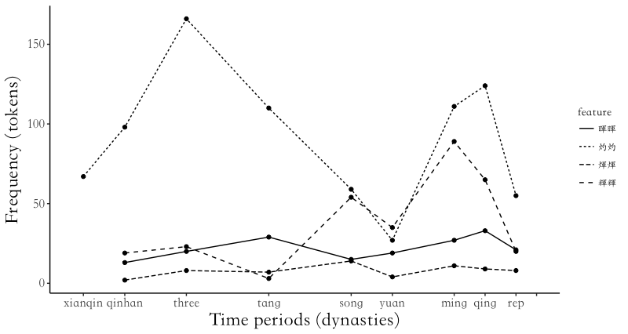
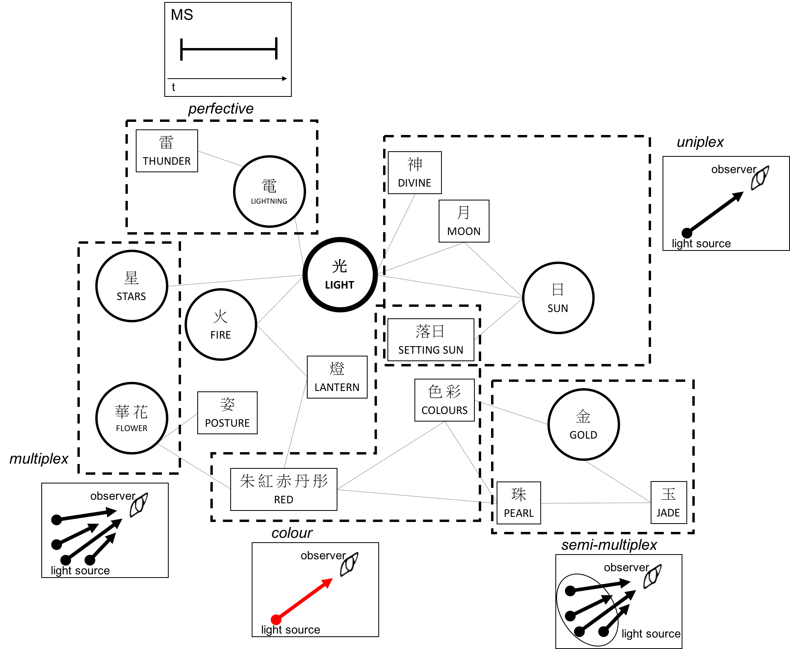
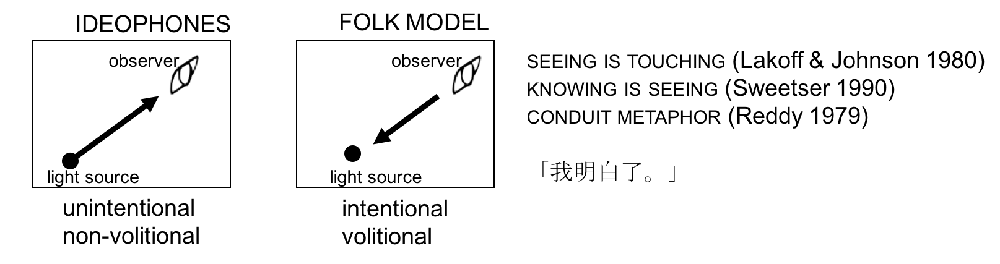

```{r setup, include=FALSE}
library(tufte)
knitr::opts_chunk$set(echo = FALSE)
```


# Introduction
In the last twenty to thirty years, scholarly attention for ideophones and sound symbolism has slowly left the margins of linguistic study (Joseph 1997) as multiple researchers of language-specific studies put their findings together, resulting in conference proceedings like Sound Symbolism (Hinton, Nichols & Ohala 1994) and Ideophones (Voeltz & Kilian-Hatz 2001), in an attempt to readdress the Saussurean dictum of the arbitrariness of the sign. While this study attempts to continue this scholarly aspiration of discovering non-arbitrary elements in language, it will show that there is much flexibility and dynamicity in the meaning side of such sound-symbolic items, like ideophones. 

This will be done by first briefly surveying the state of the field (section 2.1), introducing a cognitive folk model of symbolic assemblies consisting of [sound/writing/meaning] (section 2.2), and narrowing down the scope to LIGHT ideophones based on phonaestheme research and data this study inherited from a phonological pre-study (sections 2.3 and 2.4). Next, some methodological points will be made: first, how three Cognitive Linguistic perspectives on the meaning of ideophones may be unified into a four-level model inspired by recent advances in Conceptual Metaphor Theory (section 3.1). Second, how diachronic prototype semantics will further our understanding of the semantics of LIGHT ideophones (section 3.2). These two perspectives essentially form the research question (section 3.3) that drives this research: what does a leveled approach with attention to polysemy and prototypicality reveal about the nature of ideophones? The answer will be revealed in four corpus-based case studies (section 4), after which some discussion with the relevant literature will be made (section 5) and a conclusion (section 6).

# The background for this study
## A brief survey of the state of the field of ideophone research

Linguistic non-arbitrariness, sound symbolism, can be understood as a direct iconic link between the phonological pole and the semantic pole of a symbolic assembly, in Langackerian terms (Langacker 1987; 1988; 1991a; 2000; 1991b; 2008) . But what are ideophones? The earliest definition follows Clement Doke: "A vivid representation of an idea in sound. A word, often onomatopoetic, which describes a predicate, qualificative or adverb in respect to manner, colour, sound, smell, action, state or intensity" (Doke 1935:118). A more recent definition, by Mark Dingemanse, defines them as "marked words that depict sensory imagery" (Dingemanse 2011:25). While the former definition has the advantage of being applicable to the language group it was found in (Bantu languages), it lacked the cross-linguistic applicability Dingemanse's definition attempts to provide. We accept Dingemanse's definition as a cross-linguistic comparative concept (Haspelmath 2010a), while at the same time recognizing the need for more language-specific categorical description (Haspelmath 2007; 2010b). In terms of Chinese (or Sinitic languages), an exact definition is still lacking, but certain prominent features seem to exist in what is considered ideophonic. Let us discuss these different markedness strategies.

From a morphological perspective, these words often display full reduplication or partial reduplication, e.g. 汪汪 wang~wang 'woof-woof', and 忐忑 tan~te 'perturbed, disturbed', traditionally described in terms of either letters (respectively AA for full reduplication and AB for partial reduplication) or in terms 'reduplicative characters' (diezi 疊字), 'alliteration' (shuangsheng 雙聲), or 'reduplicative rhyme' (dieyun 疊韻, as in the case of cuotuo 蹉跎 'wasting time'). It should also be mentioned that Chinese perspectives on this issue usually place a large emphasis on the so-called ABB construction, where a (seemingly) random word collocates with an ideophone to create an even bigger ideophone, such as liang-jingjing 亮晶晶 'glittering, sparkling' in Mandarin, or kim-siaksiak 金爍爍 'golden' in Southern Min (Taiwanese). In more formal treatments of Chinese phonology and morphology, the semantics and pragmatics of these constructions are downplayed, as can be seen in a recent reference grammar of Chinese (Huang & Shi 2016), where virtually no attention is devoted to the diachronic evolution that led to the synchronic constructions that appear in Modern Chinese. However, it must be admitted that morphologically there has been much research devoted to this question, which can be built on in future research.

So, what other ways of markedness have been observed in ideophones? Apart from phonological investigations of tone (Mok 2001; Chang 2009), the field is still very young for Chinese languages. In many other languages, however, the experiential nature of ideophones has been put to the fore. For example, the multimodality of Quichua ideophones is argued to be so important to the nature of the usage of this word category that traditional dictionaries, let alone a simple glossing, are unable to do their semantics and pragmatics justice (Nuckolls 1996; 2016; 2017). The multimodality in question refers to the accompanying gesture, which appears quite naturally when they are 'performed' in spoken natural (non-elicited) language, without however being necessary nor sufficient for the ideophone's semantics. In other words, there is a high tendency for gesture and the ideophone to co-occur, but it need not be that way. 

Similarly, multimodal foregrounding can also be observed in Japanese ideophones. Dingemanse & Akita (2016) showed in their study of earthquake victims interviewed by the Japanese television broadcasting company NHK how apart from gesture, intonational foregrounding also plays a huge role in the performance and markedness of ideophones. For example, they observed deviations from the normal pitch range-ideophones being spoken either with a higher or lower pitch than the rest of the clause. Also extra intonational pauses seemed to separate the ideophone from the clause, presumably to allow some time for the listener to mentally simulate or experience the semantics conveyed by the ideophone in this context. Other foregrounding mechanisms mentioned by Dingemanse & Akita in this study are phonational in nature, e.g. the use of breathy, creaky, whispering and even growling voice. 

In summary, these morphological, gestural, intonational, and phonational markedness seem to feature prominently in the categorization of lexemes as ideophones. A recent development for Japanese and Korean ideophone systems is attributing scores according to different parameters to lexemes, in order to study their 'canonicality' (Kwon 2015; 2017), similar to how transitivity has been treated in the past (Thompson & Hopper 2001). However, an investigation into the applicability of these criteria to Chinese ideophones has not been undertaken yet.

Now, after briefly sketching the state of the field, we must turn to the current study object, which is diachronic in nature. It was necessary to discuss the multimodality of ideophones in order to understand what is lost when performing this kind of research: study of (contemporary) synchronic linguistic data allows the researcher to gather material, like video or even audio recordings, that might show how certain phrases and constructions are marked in ways mentioned above. This is not available in diachronic research. However, with Chinese we are in a relatively good position-the availability of large historical corpora, native traditions of lexicography, and a writing system that, even through stages of reanalysis, contains much semantic information beneficial for our understanding of ideophones and their development through time. In our phonological analysis below, we will discuss the case study of ideophones that are situated in the semantic domain of LIGHT. There are two reasons for choosing this semantic domain, which will have consequences for assumptions made in this research. 

## A cognitive folk model
The first reason is rather coincidental in nature: a few weeks ago we attended a musical concert titled xingguang yiyi 星光熠熠 'starlight shining bright'. However, after an informal questionnaire, it turned out that not everybody was able to read this 熠熠 out loud as yìyì [ji˥˩ ji˥˩], but that some people faultily guessed the pronunciation of this word was zhézhé [ʈʂɤ˦˥ ʈʂɤ˦˥]. It struck us as very revealing that the people participating in this very informal study were able to recognize this word yiyi 熠熠 as an ideophone, with the right semantics, but that the entrenchment of its pronunciation was not of the same the degree as its semantics. To us, it seemed further evidence of how symbolic assemblies, as they were construed in Langacker's work on Cognitive Grammar (Langacker 1987), with their phonological poles and semantic poles, as the only three units by which language can be analyzed perhaps do not account for the full system as it is experienced in China. That is to say, for spoken language, this framework appears to us as one of the best out there, with a strong explanatory power. However, recently more voices have been calling out to also consider the written language when discussing grammar (Iwasaki 2015). With respect to Chinese, this integration has been argued for by e.g. Packard (2001:306), and with regards to Chinese and Japanese ideophones, it has been argued by Lu (2006) that a better semiotic model should connect <sound>, <writing> and <meaning> into a <symbol>. Building on this model, we have shown before that it could explain two different strata in the current ideophonic vocabulary of Mandarin Chinese, with some ideophones being interpreted as more literary, supported by the writing system, and others being more colloquial without this support. Both groups, however, had the morphophonological support (Van Hoey 2017). The assumption that we make here, then, is that languages that do not have a tradition of writing, are describable in terms of Langacker's symbolic assemblies, but that for languages that do have a writing system, there might be an integration effect, differing in degree per language (and perhaps even per construction?). The cognitive semiotic model for Chinese (presented in 1) follows Lu's characterization, but is simplified to capture its essence. A curious note is that this model has a folk model in the idea that Chinese characters are the combination of shape, sound and meaning (Hanzi de 'xing yin yi' 漢字的「形 音 義」).

$$[\frac{sound}{writing}|MEANING]$$


In this model, it is still assumed that there are symbolic assemblies through which most linguistic phenomena can be explained. However, instead of only one formal pole, it is split into a <sound> pole and a <writing> pole. The adoption of this model allows us to discuss the different ideophones according to their phonological form and written form, although considerably more analysis will be devoted to the first.

# Phonaesthemes and the phonological pre-study
Let us return to the motivations behind our study of LIGHT ideophones in Premodern Chinese. The second reason to do so, lies in the long tradition investigations into phonaesthemes have had in the 20th century. As Lockwood & Dingemanse (2015) discuss, the English gl- phonaestheme has a long history, capturing the attention of big figures in linguistics like Leonard Bloomfield. However, we have not found more in-depth analysis of this word cluster than in the works of Magnus (2001). She categorizes the different semantic differences in gl- phonaesthemes according to the manner of light perception (2-4). 


\begin{exe}
    \ex \begin{xlist}
        \ex Reflected or indirect light\\
            glare, gleam, glim, glimmer, glint, glisten, glister,               glitter, gloaming, glow
        \ex Indirect use of the eyes\\
            glance, glaze, glimpse, glint
        \ex Reflecting surfaces\\
            glacé, glacier, glair, glare, glass, glaze, gloss
        \end{xlist}
\end{exe}


We believe that her work is valid, although it is hard to claim that we are dealing with a real iconic mapping between <sound> and <meaning>; it has been argued that the gl- derives from a Proto-Indo-European stem *GHEL 'yellow' (Thompson 2017), although this does not necessarily rule out an iconic relation. What can be said, however, is that there is a network of similar sounds that express related meanings, i.e. phonaesthemes. Taxonomies of sound symbolic phenomena subsume these phonaesthemes in conventional sound symbolism (Hinton, Nichols & Ohala 1994) or diagrammatic relative arbitrary iconicity (Sidhu & Pexman 2017). This last classification highlights the nature of the iconicity relation in examples (2-4): diagrammatic, as opposed to imagic. As Dingemanse (2012) discusses through his usage of Peircean terminology, there is a gradation (rather than clear dichotomy) from imagic iconicity, pure onomatopoeia, e.g. 'woof-woof', to diagrammatic iconicity, which depicts more abstract domains (Van Hoey & Lu, soon to be under review). 

In the preceding paper that focused on the phonological relation of literary Chinese ideophones situated in the semantic domain of LIGHT, the same assumption was made, viz. the search for a clear sound symbolic relationship between <phonological form> and <meaning> must be abandoned, even before the data was to be presented. What, however, did lie within reach, is a quest for networks of formal features that are related to similar sets of meanings. We will quickly discuss how this pre-study was conducted and some of its relevant implications. 

From our usage-based database  and the comprehensive online dictionary Handian 漢典 35 types of ideophones were collected, all with a reduplicative or partial reduplicative morphology (the AA and AB-types discussed above), and all depicting LIGHT in some way, e.g. (4-6).

\begin{exe}
	\ex 灼灼 zhuózhuó 'evident, brilliant, aglow, vivid and vibrant, brightly blazing, plain and patent'
	\ex 爍爍 shuòshuò 'flashing, flaring, effulgent, alight, rutilant; splendrous' 
	\ex 煇煇huīhuī 'fire-red, blazing brightly; splendid; brilliant'
\end{exe}

 The single syllables of these ideophones were then reconstructed to Middle Chinese and Old Chinese using Baxter and Sagart's systems (Baxter 1992; Sagart 1999; Baxter & Sagart 2014; 2015), see Table 1. Based on the Old Chinese reconstruction, some were categorized as belonging to the same word family, a term for words that share the same root but have different affixes (Sagart 1999; Baxter & Sagart 2014). In our case, we used Bybee's (1985; 2001) way of linking different stems using phonemes, as is shown in Figure 1.


| Nucleus = e Coda = obstruent | Nucleus = ə Coda = nasal | Nucleus = a Coda = nasal |
|------------------------------|--------------------------|--------------------------|
|                              |                          |                          |
|                              |                          |                          |
|                              |                          |                          |

TABLE
Table 1: Reconstructions to Old and Middle Chinese

```{r, bybee, fig.cap="Word families in Bybee's theories", out.width="5in"}
knitr::include_graphics("ideos/bybee.png")
```


The phonological analysis showed that rather than stating a direct, imagic sound symbolism between certain phonemes and the semantic domain of LIGHT, there seemed to be a slight negative correlation between labials and glotals, and a positive tendency for coronal and dorsal features, both obstruents and nasals. However, it was concluded that the most important finding was that we are in fact dealing with small networks of word families that were reanalyzed throughout history. Furthermore, they seemed to mainly fall into two big and dynamic prototypical clusters with fuzzy edges, at least according to their type frequency. It does raise the question whether the same prototypicality effects can be observed in their semantics, and their token frequencies. Both of these issues will be explored in this paper.

# Data of the current study
As mentioned at the end of last section, we want to explore the notions of prototypicality and token frequency effects in the diachronic semantic development of LIGHT ideophones. Rather than aiming for a superficial study of the whole semantic field, we have opted for more fine-grained analyses of the data we inherited from the phonological study. More specifically, we will only treat those ideophones that have a schwa nucleus and obstruent coda in their Old Chinese reconstruction, and focus mostly on their full reduplication forms-AA is the most prototypical way of forming ideophones in Middle Chinese (and also Old Chinese), as was shown earlier by Van Hoey (2015). 

TABLE 2:  Ideophone types used as material in this study

Let us then first turn to the types that will be investigated in this study. Table 2 shows these data points. We have listed them with their Chinese characters (traditional characters), their Hanyu pinyin transcription into Modern Mandarin, the Taiwanese Ministry of Education (MOE) Dictionary definition, and the corresponding definition in Kroll's (2015) A student's dictionary of Classical and Medieval Chinese. It should be noted that the 2nd century AD Shuowen jiezi 說文解字 "Explaining Graphs and Analyzing Characters" native dictionary glosses most of these characters (or words) (see Baxter & Sagart 1998) as either meaning LIGHT (guang ye 「光也」) or SHINING (zhao ye 「照也」), with only occasionally mentioning the source of the LIGHT, e.g. 'lightning beam' (dianguang ye 「電光也」). The later 18th century Kangxi Dictionary 康熙字典 uses almost the same explanation, so we have not provided either in our discussion here. What can be learned from these dictionary explanations is that these words are treated as (near-)synonyms. However, below we will show that their meanings do differ in their semantic preference or collocational habits. But first we need to explain the methodology used in this study.

# Methodology and research question

While it is certainly necessary to adopt a comparative concept  for ideophones, we should also try to come up with a certain definition of the language-specific category (Haspelmath 2010a) of 'ideophones'. For comparative concepts, we follow Dingemanse's definition, as mentioned above (section 2.1) For now, it falls outside the scope of this study to come up with certain criteria (organized classically or prototypically) for such a language-specific category of ideophones, but we believe they should be proposed usage-based and form the bottom-up. That is why we focus on different lexemes in this study, lexemes that were argued to be ideophonic to the Chinese literati culture of ages past. Three possible definitional frameworks to ideophones will be discussed in the section below in an attempt to unify them through recent advances in Conceptual Metaphor Theory. After this, we must turn to the theory of diachronic prototype semantics, and how it will be of use in this study. Lastly, the research question will be restated, with all this background information.

## Unifying three Cognitive Linguistics definitional frameworks
The first Cognitive Linguistics-oriented framework for discussing the semantics of ideophones is represented by Janis Nuckolls's ongoing studies of Pastaza Quichua ideophones (Nuckolls 1996; 1999; 2001; 2010; 2014; Nuckolls et al. 2017). She uses IMAGE SCHEMAS as the main way of representing an ideophone's most basic meaning. In the most recent work referred to here, however, she revisits some of her case studies to stress their dynamic and multimodal nature, e.g. polang is shown to be licensed by either a 'glide across water' or 'glide up to the surface of the water' schemas. It is important to note that IMAGE SCHEMAS here seems to be interpreted more according to Johnson's (2005) rich semantic scenarios than the slightly more abstract usage found in most discussions on the term (Hampe & Grady 2005; Oakley 2007). That being said, the difference between the two is only one of gradation.

A second framework is Lu Chiarung's 呂佳蓉 (2006) treatment of Japanese (and Mandarin Chinese) mimetics or ideophones. Lu stresses the scenario or script nature of ideophones and thus uses an IDEALIZED COGNITIVE MODEL (ICM) (Lakoff 1987) approach. Her main examples are Japanese korokoro コロコロ '(something small) rolling' and gorogoro ゴロゴロ '(something large) rolling'. She shows that the dimensions of the object, as well as the manner of movement etc. can be abstracted into an ICM that could be used to define the meaning of these lexemes. 

The third framework is represented by Akita Kimi 秋田喜美: FRAME SEMANTICS. Akita argues that Japanese ideophones tend to be highly specific in their semantics and invoke highly specialized frames, with little semantic extension (Akita 2012). This is contrasted with the way SOUND ideophones are depicted in Chinese, slightly vague and with many possible referents (Akita 2013). However, as soon as we leave the imagic iconicity of SOUND ideophones to more diagrammatic end of the iconicity spectrum (Dingemanse 2012), it will become untenable to state that Chinese ideophones are only vague, and not polysemous, as we will illustrate with LIGHT ideophones.

The three frameworks briefly discussed above all agree on the encyclopedic nature of ideophones, their multimodality, and their foregrounding markedness. However, it is hard to say that any of these analyses is 'the right framework', because they all emphasize different aspects of meaning description. IMAGE SCHEMAS try to capture the most prototypical meaning (similar to Tyler & Evans' (2003) notion of the so-called PROTOSCENE for prepositions); FRAME SEMANTICS, conversely, stress the high specificity of ideophones; ICMs occupy the middle ground and are perhaps most flexible, but only because they are flexible by nature. 

However, maybe we do not have to choose. Kövecses's (2017) most recent study proposes an analysis on different levels of metaphor: on the lowest level there are MENTAL SPACES, which connect the metaphors online (working memory) as the discourse happens dynamically. One level higher there are FRAMES and DOMAINS. DOMAINS are "not analogue, imagistic patterns of experience but propositional in nature in a highly schematic fashion" (Kövecses 2017:325), while FRAMES elaborate particular aspects of the domain matrix. They are all elaborations of the highly abstract IMAGE SCHEMAS, which are directly meaningful preconceptual structures, that are highly schematic Gestalts, consist of continuous analogue patterns and have an internal structure consisting of only a few parts (Kövecses 2017:324). Figure 2 below attempts to capture these different levels of metaphor in a diagram.

 
HERE IS A FIGURE


Based on in-class discussions of ideophone-related research, it increasingly appears possible to say that ideophones are very similar to metaphor: both are cognitive abilities but are also very culture-specific. This notion deserves further exploration, but unfortunately it falls outside the scope of this study. However, future research should devote considerable attention to it. For now, we will assume that Kövecses fourfold level approach to metaphor can also be used for ideophones. Furthermore, for our purposes, it seems that DOMAINS can be thought of as Lu's ICMs. Let us keep this in mind as we turn to the second idea that drives this research: diachronic prototype semantics.

## Diachronic prototype semantics
One of the big themes that propelled the Cognitive Linguistics movement is the attention it devotes to semantics. As the semanticist Dirk Geeraerts explains, in this framework, "language is seen as a repository of world knowledge, a structured collection of meaningful categories that help us deal with new experiences and store information about old ones" (Geeraerts 1997:8). Two crucial issues in this theory of categorization are the notion of prototypicality and that of polysemy. Prototypicality emerged from a series of experiments by psycholinguist Eleanor Rosch (1975; 1975) as a theory of categorization that opposed the traditional categorical definitions which required necessary and sufficient conditions. Rather, it was shown that some members of a lexical field are better representatives of it than others, e.g. the robin is the most prototypical BIRD in Anglo-Saxon culture, because it has wings, feathers etc. On the other hand, penguins, ostriches and the like are less typical representatives of BIRD. Now the question that relates this very brief summary to our study is, can we find the same prototypical structure in the semantics of LIGHT ideophones? 

This question presupposes that an ideophonic item is polysemous (the second notion), i.e. a series of interrelated meanings that are activated according to the situation they are used in. Most Cognitive Linguists appear to reject the idea that there is a single meaning for a given lexical item (the monosemy hypothesis), instead opting for the polysemy hypothesis. But if there is polysemy, how can we discern it from vagueness? Useful discussions of the different approaches to the phenomenon can be found in Tuggy (1993) and Geeraerts (2006a; 2010), to name just two. Let us illustrate this with a classic example: fruit. In a monosemous approach, such as the idealist Natural Semantic Metalanguage developed by Wierzbicka (Wierzbicka 1992; Goddard & Wierzbicka 2014) they would give a definition built with so-called semantic primes, concepts that exist in every language they have developed the theory for. The idea is to get at the core experience or core reasoning people use when they talk about fruit. Geeraerts, on the other hand, does not agree with this and stresses the prototypical polysemous structure of a word such as fruit. It is polysemous because it has at least the meanings 'something that people can eat and that grows on a tree or a bush' and 'the result or effect of something'. However, it is also vague, with regard to the differences between oranges and watermelons, because those differences do not lie at the basis of a distinction between senses (Geeraerts 1997:18-19). 

We have not gone in depth into the distinctions between the two approaches (see for instance Geeraerts (2006b) for a detailed discussion), but we think the polysemy with prototypicality is the more interesting approach for this study. This is especially true in Geeraerts's volume on diachronic prototype semantics, in which he discusses the prototypical nature of the concept of 'prototypicality' itself (Geeraerts 1997:22), and some of the differences in semantic changes that follow from it by stressing different parts of the concept. We present it here in the revised version (Geeraerts 2010:189), in Table 3. 

TABLE
	Extensional characterization
(on the level of exemplars)	Intensional characterization
(on the level of definition)
Non-equality
(salience effects, core/periphery)	(a) differences of typicality and membership salience	(b) clustering into family resemblances
Non-discreteness
(demarcation problems, flexibility)	(c) fuzziness at the edges, membership uncertainty	(d) absence of necessary-and-sufficient definitions
Table 3: Four types of prototypicality effects

These four different types of prototypicality effects are put in a diachronic perspective by Geeraerts (1997) and in a synchronic perspective in Geeraerts (2010). Since our research is diachronic in nature, we will follow the first of these two. As he relates (Geeraerts 1997: 23), the four effects are as follows (7-10):

\begin{exe}
	\ex By stressing the extensional non-equality of lexical-semantic structure, prototype theory highlights the fact that changes in the referential range of one specific word meaning may take the form of modulations on the core cases within that referential range.
	\ex By stressing the intensional non-equality of lexical-semantic structure, prototype theory highlights the clustered set structure of changes of word meaning.
	\ex By stressing the extensional non-discreteness of lexical-semantic structure, prototype theory highlights the phenomenon of incidental, transient changes of word meaning.
	\ex By stressing the intensional non-discreteness of lexical-semantic structure, prototype theory highlights the encyclopaedic nature of changes in word meaning.
\end{exe}


These four effects are all very interesting, but the one that is of most interest to our current study is number 8. When this aspect of prototypicality is stressed, the overall configuration of the various readings of a word comes to the fore. This highlights two phenomena: first, the overlapping and interlocking of the different readings, with attention for the different starting points in existing meanings a novel meaning may have. Second, the differences in structural weight among the different meanings of an item. Some meanings do not survive very long, other, more important (and prototypical) meanings persist through time. Geeraerts (1997: 47-62) shows this through the analysis of the Dutch verb ver-grijpen 'mis-take'. After showcasing different meanings in different historical contexts, he summarizes the data in a very nice visualization, first shown in Geeraerts (1983), presented in Figure 3.

```{r levels, fig.cap="Vergrijpen"}
knitr::include_graphics("ideos/vergrijpen.pdf")
```


From the Figure above, we make three main observations. Firstly, new meanings arise from the joint influence of several meanings, e.g. meaning F 'to do something forbidden' has its conceptual starting points in A 'to use physical violence against (someone)', as well as B 'to oppose someone to whom one owes respect and obedience'. Secondly, some meanings crop up occasionally, but do not persist in time, such as Q 'to commit suicide' can be seen as an extension of A, but it is used in only one time period, 50 years in this case. Thirdly, not all concepts are equally important in the process of semantic change. For instance, A, B, C and F are more important than meanings E and G. This diagram reveals much about the development of semantic structure, and we will explore it further below.

## Research question
In general, it can be summarized from the preceding sections that a diachronic analysis of ideophone semantic structure calls for a nuanced leveled approach (section 3.1) with attention to prototype effects in the polysemy of these items (section 3.2). We believe that such an approach is innovative in many ways. For example, in section 2.4 we showed that most dictionaries treat these LIGHT ideophones as (near-)synonyms. However, as the case studies in section 4 will reveal, this is far from their actual behaviour. So now we restate the research question that drives this study: what does a leveled approach with attention to polysemy and prototypicality reveal about the nature of ideophones? Let us try to answer the question from different perspectives in the case studies below.

#Mental spaces and Frames: corpus-based case studies
To study the items presented in Table 2 we made use of the very comprehensive Scripta Sinica (Academia Sinica 中央研究院 2015) corpus. For the present purpose, it must be noted that the corpus divides its materials in periods of roughly 300 years, following the traditional Chinese approach to historiography. In the visualizations below, we have added a timeline to orient the reader who is not familiar with Chinese dynastic history. This has two consequences: in comparison with Geeraerts, it was not possible to do the same fine-grained analysis as he did (periods of 50 years). On the other hand, it did make it possible to see the bigger 'macroevolutions' of the semantic networks. In the context of the bigger Chinese historical corpus, the second evolution seems the most interesting for the present.

It should also be mentioned that we tried to follow Tyler & Evans' (2003:38-45) methodology for determining different senses of the different items, while trying to avoid the so-called 'polysemy fallacy', i.e. positing more meanings than there actually are. In this regard, the basic meaning of LIGHT may be maintained on the most abstract level of image schemas but in the lowest level of mental spaces it is untenable, as semantic preference (Geeraerts 2010:170-173) clearly demonstrates, e.g. yeye 曄曄 co-occurs mostly with plant-like meanings, as well as light sources. This would count as at least two frames (a Plant frame and a Lightsource frame), divided in many mental spaces. This will be illustrated below clearer below.

Thirdly, one can wonder why a study on semantics is so lacking in examples. This has a practical reason: we believe it is more important now to focus on what the cases studies reveal than highlighting many examples. However, the results were based on some 3500 tokens, which is a decent number of examples to analyze manually. The distribution of token frequency was not equal though, as e.g. zhuozhuo 灼灼 was the most frequently used ideophone in our dataset. See Figure 7 for a comparison against three other ideophones.

Lastly, a methodological note: to consider a meaning as prototypical we had three criteria that interplayed with each other: whether the meaning persisted through time; whether it was productive for other meanings; and whether it occurred in with high frequency. Given the unevenness in the distribution, we have generally considered a tally of 5 occurrences of a given meaning in a given period as 'high frequency'. Of course, compared to really frequent items, e.g. closed-class items, this pales in comparison. However, for ideophones it counts a high enough-bear in mind that ideophones are presumed to be mostly performed in spoken language, all we can work with in historical sources are the traces they left behind in writings.

Let us now turn to the case studies, which all highlight a different aspect of the prototypical and polysemic nature of LIGHT ideophones.

## Yueyue 爚爚
In the case of yueyue 爚爚, Figure 4 shows that there is a clear prototypical core from its earliest occurrence, in the Qin-Han 秦漢 dynasties (ca. -221 BC - 220 AD). The main item yueyue describes is LIGHTNING. At the same time, there is a meaning of SHOOT, which we interpreted as a metaphor ('lightning fast'), although it is speculation. Around the Tang dynasty, more LIGHT meanings develop, related to the prototypical LIGHTNING: LIGHT (in general) and STARS. From these onward there are usages that involve PEARLS and GOLD. There is a large hiatus between the Yuan dynasty and the resurfacing usage of LIGHT in the beginning of the 20th century. We presume LIGHT has taken over the main prototypical core of yueyue and was still in use, but unrecorded, until it resurfaced.

```{r yueyue, fig.cap="yueyue 爚爚"}
knitr::include_graphics("ideos/yueyue.pdf")
```

The visualization attempts to be improve upon Geeraerts's, shown above. The difference in line thickness depict the higher and lower frequency. The dotted lines indicate a presumed continuation of a certain meaning. The dotted arrows are used to represent meaning extensions, following Langacker's (2008:37) convention. Furthermore, in order to aid the specialized reader that wants to perform the research him/herself, we have included some of the more frequent collocations in Chinese next to the meaning.

This case study of yueyue has shown how the visualizations should be read and what can minimally be inferred from all of them. Let us move on to the next case study.

##Yaoyao 燿燿 and yaoyao 耀耀
The title of this case study shows that there is some variation in the written form of yaoyao. The main difference is the radical that distinguishes the two: either FIRE 火 or LIGHT 光. Does this onomasiological (from meaning to form, as opposed to a semasiological perspective, from form to meaning) difference show up in the usage of these two items? In fact, it does. As Figure 5 clearly shows, yaoyaoFIRE has an early usage of depicting LIGHTNING. This meaning is later picked by in yaoyaoLIGHT during the Tang dynasty. Conversely, yaoyaoLIGHT has a metaphorical extension to describe the POSTURE (of women) as 'radiant, shining', which finds its way in the meaning matrix yaoyaoFIRE. This curious exchange of meanings shows the mutual influence related semantics and a related phonological form may have on each other.

```{r yaoyao, fig.cap="yaoyao 燿燿 and yaoyao 耀耀"}
knitr::include_graphics("ideos/yaoyao.pdf")
```

## Huihui 煇煇, huihui 輝輝 and huihui 暉暉, vs. zhuozhuo 灼灼
The next ideophonic trio displays similar effects as the two yaoyaos discussed above: huihuiFIRE, huihuiLIGHT and huihuiSUN also mutually influence each other. However, there is more going on. In Figure 6 it can be seen that the meanings of huihuiFIRE and huihuiSUN are fewer in number than those of huihuiLIGHT. All three, however, have their own special usage, with e.g. huihuiFIRE used mostly for LIGHTNING, but also in a Chinese traditional medicinal context of DEAFNESS. What binds these three together is their ability to depict different kinds of light, as well as shades of RED. 

```{r huihui, fig.cap="huihui 煇煇, huihui 輝輝 and huihui 暉暉"}
knitr::include_graphics("ideos/huihui.pdf")
```

Now, this interplay between the three items is asymmetrical in a way, precisely because huihuiLIGHT has the most productive set of interrelated meanings. It has a higher type frequency, the effect of which is the reinforcement of its productivity, similar to the English past-tense suffix -ed (Bybee 2001). This polysemy was already found in the earliest period the ideophones were encountered. We can only assume that they were extended from even earlier meanings. That being said, does this high type frequency also translate into high token frequency? Figure 7 below shows that it clearly does, especially during the latter half of the Chinese empirical history.

The effect of this high token frequency for huihuiLIGHT entrenches certain meanings the more it is used. Let us take another ideophone, zhuozhuo 灼灼, as a standalone example of how token frequency cements certain meanings, and leaves dynamic usage for other ones. It should be noted that zhuozhuo was the ideophone with the highest token frequency throughout history, as can be seen in Figure 7 as well. 

```{r huizhuo, fig.cap="token frequencies of huihui and zhuozhuo"}

``` 


The meaning matrix of zhuozhuo revolves mostly around the shining brilliance of things associated with spring and the blossoming of FLOWER LEAVES, PINKISH RED and PEACH TREES. This extends to depict the dazzling colours of CHRYSTANTHEMUMS, but also to 'normal LIGHT' items. Another extension from the prototypical bundle is that to the concept of DENSENESS OF PLANTS. There is also a seemingly anomalous usage of zhuozhuo to depict turtle(shells?), which we were not able to convincingly relate to any of the other meanings.

What can be summarized from this exploration of the three huihuis and zhuozhuo is that type frequency as well as token frequency certainly have observable effects in the semantic structure of these items.

##Yeye 爗爗, yeye 燁燁 and yeye 曄曄
The last case study, presented in Figure 7, shows the development of yeyeFIRE+SUN, yeyeFIRE and yeyeSUN. It highlights two important features of applying diachronic prototype semantics to LIGHT ideophones. First, it is shown once more that the meanings (semantic preferences) of these ideophones are dynamic, and are made in a case-to-case basis, which is exactly what mental space theory suggests. They are also mediated by the slightly more abstract frame theory, which in a way acts as a highly-specialized repository of patterns. 

Secondly, there is a shifting or transient prototypicality in these items, from two perspectives. Semasiologically (from form to meaning), this is expressed again in the different meanings that are more prevalent during a certain period. Onomasiologically (from meaning to form), yeyeSUN is the most productive in the former half of the Chinese empirical history, but this role is taken over by yeyeFIRE in the latter half. The complex written form of yeyeFIRE+SUN probably also influenced its sporadic usage throughout time-there was already a form with FIRE and a form with SUN that were both quite productive, so there was not really a need for the complex FIRE+SUN grapheme in order to replace one or the other (although a merge between the FIRE form and the SUN form might have happened!). 


```{r yeye, fig.cap="yeye 爗爗, yeye 燁燁 and yeye 曄曄"}
knitr::include_graphics("ideos/yeye.pdf")
```


#Domains/ICMs and Image Schemas
As we have argued in the sections above, we have successfully adopted Kövecses's (2017) levels of metaphor theory to ideophones for mental spaces (on a case-to-case basis) (Fauconnier 1994; Fauconnier & Sweetser 1996) and have in fact observed highly specialized frames when these meanings became entrenched, as Akita (2012) suggested. Let us now abstract it one level higher, to domains or ICMs (Lu 2006). This done by taking the most prototypical meanings as they occur in the case studies in a network and grouping them by their conceptual similarity.

```{r domains, fig.cap="Domains, ICMs and Image Schemas"}

``` 

Figure 8 shows the result of such an exercise. When the different frames, e.g. the prototypical LIGHTNING frame (in a circle), and their extended frames, e.g. THUNDER (in a rectangle) are grouped like this, it can be argued that the Domains or ICMs that bind these frames together are different highlights of an underlying Image Schema. For the SUN related frames, the uniplex domain shows how there is a single light source, which reaches the observer. Light sources can also be multiplex (Lakoff 1987; Talmy 2000), as in the case of STARS or FLOWERS, where it is the distributed collectivity of light sources that depict the 'LIGHT' in this case. It can also be somewhere in between, as in the case of metals like GOLD and related frames, where (presumably) it is different smaller sparkling places within a bounded entity that depict the LIGHT. For this reason, we have used the term semi-multiplex. Another aspect that can be highlighted is the colours, with a strong preference for RED. Since this is related to the reddish glow of the SUN, FIRE as well as FLOWERS, it is motivated yet an unexpected productive domain of extension. Finally, the boundedness or perfectivity (Langacker 2008:151, 156-157) of a LIGHT-related event may be highlighted as well, as in the case of LIGHTNING and THUNDER. 

```{r folk, fig.cap="Two different folk models"}

``` 

Now, the reader may wonder why the most prototypical sense of LIGHT is not included in any of these ICMs. Since in a way it is the result of the overlapping meanings, it may be more useful to consider it a proto-scene or Image Schema of 'LIGHT FALLING INTO THE OBSERVER'S EYES'. Notice how this differs from our usual way of understanding how light works. From a scientific point-of-view (pun intended), a light source emits beams of light that are caught by the observer's retina and translated into electrical signals that are sent to the brain for decoding, or that is how basic optics in physics works. However, our folk model of light, at least as far as I have experienced it thus far, thinks of SEEING and LOOKING AT as something volitional or intentional. This is made clear by certain conceptual metaphors such as SEEING IS TOUCHING (Lakoff & Johnson 1980), KNOWING IS SEEING (Sweetser 1990) or special instances of the CONDUIT metaphor (Reddy 1979), e.g. the Mandarin wo mingbai le 我明白了 'I understand < I clear ASPECT'. In contrast to this way of thinking, there is at least one important category where this folk model is reversed: ideophones. This is not a surprise, because ideophones highlight the multimodal, mimetic and performative nature of the experience, which is often unintentional. The different models are presented in Figure 9, and capture the essense of the highly abstract Image Schemas very well.


# Conclusion
Using literary Chinese ideophones in the semantic domain of LIGHT as case studies has revealed that the application of diachronic prototype semantics in combination with the stratified 'levels of metaphor' approach to the study of ideophones is a fruitful venture. Regarding prototypicality, it was shown that the meanings form interrelated clusters of polysemy that are dynamic throughout time, with a clear prototypical cores or prototypical bundles as a core, that developed semantic extensions throughout time, see section 4.1 on yueyue. The items investigated also seemed to influence one another, as the mutual influence of the yaoyao case study displayed in section 4.2. In the next section (4.3) huihui and zhuozhuo showed that type and token frequency effects (Bybee 2001) also can play important roles in the semantic development of these items. However, prototypicality is not only dynamic between different meanings of an ideophonic item, it can also be among different variants. The case study of yeye in section 4.4 showed that some variants may be the most productive for a while, but others might take over this role at one point. Prototypicality is thus transient. 
These notions were all studied on the level of mental spaces and frames. The interplay between dynamicity and stability is a direct consequence from the flexibility mental space theory provides as a theory of online meaning construction, and the opposite entrenching force of frames. However, such an abstraction can be pushed even further. Domains or ICMs were identified that each highlight something different of the embodied Image Schema underlying most of these tokens. 'LIGHT FALLING INTO THE OBSERVER'S EYES' appears a good Image Schematic summary of what happens when people use LIGHT ideophones to depict their experience. It does, however, stand in stark contrast with the other folk model we have of SEEING (cf. section 5). 

It is now also possible to generalize about the debate between vagueness and polysemy. As mentioned in section 3.1, Akita (2012; 2013) mentions that Mandarin SOUND ideophones are vague, while Japanese ones are highly-specific. As our investigations above show, it is not a black and white case. Take for example yeyeSUN in section 4.4, which has a prototypical bundle of LIGHT, but also of FLOWER-related meanings. With regards to polysemy at least these two big meanings will have to be distinguished; with regards to vagueness, however, it can be argued that the different readings of LIGHT, STARTS, the DIVINE and MIDSUMMER are somewhat vague in the prototypical bundle of LIGHT. This resembles the example of fruit discussed in section 3.2.

And now we turn back to the cognitive folk model we adopted in section 2.2 (repeated in example 12). 

$$[\frac{sound}{writing}|MEANING]$$

We found considerable variation and dynamicity on the three poles of the symbolic assembly. In the phonological pre-study, networks of word families were found, as well as reanalysis in these networks. As for meaning, this whole study has shown the flexibility of meanings from a diachronic perspective. On the writing pole, the functional components seem to play an important conceptual role as well: FIRE 火, LIGHT 光, SUN 日, and METAL 金 all are prototypical frames identified in this study (section 5), and that is exactly what distinguishes literary Chinese ideophones from colloquial ones: the 'radical support' and motivation in the writing system, as Van Hoey as argued for weather-related ideophones in Mandarin Chinese (2017).

A study as this one is not without limitations, however. A simple example is the non-exhaustiveness of the lexical field that we were aware of since the beginning. There probably exist other LIGHT ideophones that we did not find because of the paradigmatic data collection, driven by the database and the dictionary. For example, in just the last few days, we have stumbled across yiyi 燡燡, yaoyao曜曜, weiwei暐暐 and weiwei瑋瑋, all ideophones that would have complemented this study. Yet, they would not have altered the conclusions significantly, only enriched them. It shows also that research on this topic is still only beginning and will grow incrementally as research is undertaken. Summarizing, this curious set of phenomena warrants further research, and the field is headed for a shining future, where dazzling research will help us illuminate the splendid wonders of ideophones that express LIGHT and other domains as well.


# References
Academia Sinica 中央研究院. 2015. Scripta Sinica Database (Hanji quanwen ziliaoku jihua 漢籍全文資料庫計畫). Database. Scripta Sinica Database. http://hanchi.ihp.sinica.edu.tw/ (26 June, 2016).
Akita, Kimi. 2012. Toward a frame-semantic definition of sound-symbolic words: A collocational analysis of Japanese mimetics. Cognitive Linguistics 23(1). 67-90.
Akita, Kimi. 2013. Constraints on the semantic extension of onomatopoeia. Public Journal of Semiotics 13(1). 21-37.
Baxter, William Hubbard. 1992. A handbook of old Chinese phonology. (Trends in Linguistics 64). Berlin ; New York: Mouton de Gruyter.
Baxter, William Hubbard & Laurent Sagart. 1998. Word formation in Old Chinese. In Jerome Lee Packard (ed.), New approaches to Chinese word formation: morphology, phonology and the lexicon in modern and ancient Chinese, 35-76. Berlin ; New York: Mouton de Gruyter.
Baxter, William Hubbard & Laurent Sagart. 2014. Old Chinese: a new reconstruction. Oxford ; New York: Oxford University Press.
Baxter, William Hubbard & Laurent Sagart. 2015. Baxter-Sagart Old Chinese reconstruction (v. 13 october 2015). http://ocbaxtersagart.lsait.lsa.umich.edu/BaxterSagartOC2015-10-13.xlsx.
Bybee, Joan L. 1985. Morphology: a study of the relation between meaning and form. (Typological Studies in Language 9). Amsterdam: Benjamins.
Bybee, Joan L. 2001. Phonology and language use. (Cambridge Studies in Linguistics). Cambridge, [England] ; New York: Cambridge University Press.
Chang, Yufen. 2009. The phonology of ABB reduplication in Taiwanese. In Yun Xiao (ed.), Proceedings of the 21st North American Conference on Chinese Linguistics (NACCL-21): Vol. 1, 28-41. Smithfield, Rhode Island: Bryant University.
Dingemanse, Mark. 2011. The meaning and use of ideophones in Siwu. Nijmegen: Radboud University Nijmegen dissertation.
Dingemanse, Mark. 2012. Advances in the cross-linguistic study of ideophones. Language and Linguistics Compass 6(10). 654-672.
Dingemanse, Mark & Kimi Akita. 2016. An inverse relation between expressiveness and grammatical integration: On the morphosyntactic typology of ideophones, with special reference to Japanese. Journal of Linguistics. 1-32. doi:10.1017/S002222671600030X.
Doke, Clement M. 1935. Bantu linguistic terminology. London ; New York: Longmans, Green.
Fauconnier, Gilles. 1994. Mental spaces: aspects of meaning construction in natural language. Cambridge ; New York, NY, USA: Cambridge University Press.
Fauconnier, Gilles & Eve Sweetser (eds.). 1996. Spaces, worlds, and grammar. (Cognitive Theory of Language and Culture). Chicago: University of Chicago Press.
Geeraerts, Dirk. 1983. Prototype theory and diachronic semantics: a case study. Indogermanische Forschungen 88. 1-32.
Geeraerts, Dirk. 1997. Diachronic prototype semantics: a contribution to historical lexicology. (Oxford Studies in Lexicography and Lexicology). Oxford : New York: Clarendon Press ; Oxford University Press.
Geeraerts, Dirk. 2006a. Words and other wonders: papers on lexical and semantic topics. (Cognitive Linguistics Research 33). Berlin ; New York: Mouton de Gruyter.
Geeraerts, Dirk. 2006b. Idealist and empiricist tendencies in cognitive linguistics. Words and other wonders: papers on lexical and semantic topics, 416-444. (Cognitive Linguistics Research 33). Berlin ; New York: Mouton de Gruyter.
Geeraerts, Dirk. 2010. Theories of Lexical Semantics. Oxford: Oxford Univ. Press.
Goddard, Cliff & Anna Wierzbicka. 2014. Semantic fieldwork and lexical universals. Studies in Language 38(1). 80-126.
Hampe, Beate & Joseph E. Grady (eds.). 2005. From perception to meaning: image schemas in cognitive linguistics. (Cognitive Linguistics Research 29). Berlin ; New York: Mouton de Gruyter.
Haspelmath, Martin. 2007. Pre-established categories don't exist: Consequences for language description and typology. Linguistic typology 11(1). 119-132.
Haspelmath, Martin. 2010a. Comparative concepts and descriptive categories in crosslinguistic studies. Language 86(3). 663-687. doi:10.1353/lan.2010.0021.
Haspelmath, Martin. 2010b. Framework-free grammatical theory. In Bernd Heine & Heiko Narrog (eds.), The Oxford handbook of linguistic analysis. (Oxford Handbooks in Linguistics 341-366). Oxford ; New York: Oxford University Press.
Hinton, Leanne, Johanna Nichols & John J. Ohala (eds.). 1994. Sound symbolism. Cambridge [England] ; New York, NY: Cambridge University Press.
Huang, Chu-Ren & Dingxu Shi (eds.). 2016. A reference grammar of Chinese. Cambridge: Cambridge University Press.
Iwasaki, Shoichi. 2015. A multiple-grammar model of speakers' linguistic knowledge. Cognitive Linguistics 26(2). doi:10.1515/cog-2014-0101. https://www.degruyter.com/view/j/cogl.2015.26.issue-2/cog-2014-0101/cog-2014-0101.xml (10 September, 2017).
Johnson, Mark. 2005. The philosophical significance of image schemas. In Beate Hampe & Joseph E. Grady (eds.), From perception to meaning: image schemas in cognitive linguistics, 15-33. (Cognitive Linguistics Research 29). Berlin ; New York: Mouton de Gruyter.
Joseph, Brian D. 1997. On the linguistics of marginality: The centrality of the periphery. Chicago Linguistic Society 33. 197-213.
Kövecses, Zoltán. 2017. Levels of metaphor. Cognitive Linguistics 28(2). doi:10.1515/cog-2016-0052. http://www.degruyter.com/view/j/cogl.2017.28.issue-2/cog-2016-0052/cog-2016-0052.xml (14 October, 2017).
Kroll, Paul W. 2015. A student's dictionary of Classical and Medieval Chinese. (Handbook of Oriental Studies: Section 4 China 30). Leiden ; Boston: Brill.
Kwon, Nahyun. 2015. The natural motivation of sound symbolism. Brisbane: University of Queensland PhD dissertation.
Kwon, Nahyun. 2017. Total reduplication in Japanese ideophones: An exercise in Localized Canonical Typology. Glossa: a journal of general linguistics 2(1). 40. doi:10.5334/gjgl.267.
Lakoff, George. 1987. Women, fire, and dangerous things: what categories reveal about the mind. paperback ed., [Nachdr.]. Chicago: The Univ. of Chicago Press.
Lakoff, George & Mark Johnson. 1980. Metaphors we live by. Chicago: University of Chicago Press.
Langacker, Ronald W. 1987. Foundations of Cognitive Grammar 1: Theoretical prerequisites. Stanford, California: Stanford University Press.
Langacker, Ronald W. 1988. An overview of Cognitive Grammar. In Brygida Rudzka-Ostyn (ed.), Topics in cognitive linguistics, 3-48. (Amsterdam Studies in the Theory and History of Linguistic Science v. 50). Amsterdam ; Philadelphia: J. Benjamins.
Langacker, Ronald W. 1991a. Foundations of cognitive grammar 2: Descriptive application. Stanford, California: Stanford University Press.
Langacker, Ronald W. 1991b. Concept, image, and symbol: the cognitive basis of grammar. 2nd ed., with a new preface. (Cognitive Linguistics Research 1). Berlin ; New York: Mouton de Gruyter.
Langacker, Ronald W. 2000. Grammar and conceptualization. (Cognitive Linguistics Research 14). Berlin ; New York: Mouton de Gruyter.
Langacker, Ronald W. 2008. Cognitive grammar: a basic introduction. Oxford ; New York: Oxford University Press.
Lockwood, Gwilym & Mark Dingemanse. 2015. Iconicity in the lab: a review of behavioral, developmental, and neuroimaging research into sound-symbolism. Frontiers in Psychology 6(1246). 1-14. doi:10.3389/fpsyg.2015.01246.
Lu Chiarung 呂佳蓉. 2006. Giongo, gitaigo no hiyuteki kakuchō no shosō: ninchi gengogaku to reikeiron no kanten kara. Kyōto: Kyōto University PhD dissertation.
Magnus, Margaret. 2001. What's in a word? Studies in phonosemantics. Trondheim: Norwegian University of Sciente and Technology (NTNU) PhD dissertation.
Mok, Waiching Enid. 2001. Chinese sound symbolism: A phonological perspective. Hawai'i: University of Hawai'i PhD dissertation.
Nuckolls, Janice. 2016. Rethinking mono-sensory implicational approaches to ideophones in Pastaza Quichua. Mimetics in Japanese and other languages in the world (日本語と世界諸言語のオノマトペ). Tachikawa: NINJAL.
Nuckolls, Janis B. 1996. Sounds like life: sound-symbolic grammar, performance, and cognition in Pastaza Quechua. (Oxford Studies in Anthropological Linguistics 2). New York: Oxford University Press.
Nuckolls, Janis B. 1999. The case for sound symbolism. Annual Review of Anthropology. 225-252.
Nuckolls, Janis B. 2001. Ideophones in Pastaza Quechua. In Erhard Friedrich Karl Voeltz & Christa Kilian-Hatz (eds.), Ideophones, 271-286. (Typological Studies in Language v. 44). Amsterdam ; Philadelphia: J. Benjamins.
Nuckolls, Janis B. 2010. Lessons from a Quechua strongwoman: ideophony, dialogue, and perspective. (First Peoples). Tucson: University of Arizona Press.
Nuckolls, Janis B. 2014. Ideophones' challenges for typological linguistics: The case of Pastaza Quichua. Pragmatics and Society 5(3). 355-383. doi:10.1075/ps.5.3.03nuc.
Nuckolls, Janis B., Tod D. Swanson, Diana Shelton, Alexander Rice & Sarah Hatton. 2017. Lexicography in-your-face: The active semantics of Pastaza Quichua ideophones. Canadian Journal of Linguistics/Revue canadienne de linguistique 62(02). 154-172. doi:10.1017/cnj.2017.9.
Oakley, Todd. 2007. Image schemas. In Dirk Geeraerts & H. Cuyckens (eds.), The Oxford handbook of cognitive linguistics, 214-235. (Oxford Handbooks). Oxford ; New York: Oxford University Press.
Packard, Jerome Lee. 2001. The morphology of Chinese: a linguistic and cognitive approach (Hanyu xingtaixue: Yuyan renzhi yanjiufa汉语形态学 : 语言认知硏究法). (Ed.) Shi Dingxu 石定栩. Beijing: Waiyu jiaoxue yu yanjiu chubanshe.
Reddy, Michael J. 1979. The conduit metaphor: a case of frame conflict in our language about language. In Andrew Ortony (ed.), Metaphor and thought, 284-324. Cambridge: Cambridge Univ. Press.
Rosch, Eleanor. 1975. Cognitive representations of semantic categories. Journal of Experimental Psychology: General 104(3). 192-233.
Rosch, Eleanor & Carolyn B. Mervis. 1975. Family resemblances: Studies in the internal structure of categories. Cognitive Psychology 7(4). 573-605.
Sagart, Laurent. 1999. The roots of old Chinese. (Amsterdam Studies in the Theory and History of Linguistic Science Series 4, Current Issues in Linguistic Theory 184). Amsterdam: Benjamins.
Sidhu, David M. & Penny M. Pexman. 2017. Five mechanisms of sound symbolic association. Psychonomic Bulletin & Review. doi:10.3758/s13423-017-1361-1. http://link.springer.com/10.3758/s13423-017-1361-1 (21 September, 2017).
Sweetser, Eve. 1990. From etymology to pragmatics: metaphorical and cultural aspects of semantic structure. Transferred to digital print. (Cambridge Studies in Linguistics 54). Cambridge: Cambridge Univ. Press.
Talmy, Leonard. 2000. Toward a cognitive semantics: Volume 1. (Language, Speech, and Communication). Cambridge, Mass: MIT Press.
Thompson, Arthur Lewis. 2017. Debunking phonaesthemes: The absence of iconicity. CLS-MPI Iconicity Focus Group Workshop: Types of Iconicity in Language Use, Development and Processing. Nijmegen: Max Planck Institute for Psycholinguistics.
Thompson, Sandra A. & Paul J. Hopper. 2001. Transitivity, clause structure, and argument structure: Evidence from conversation. In Joan L. Bybee & Paul J. Hopper (eds.), Frequency and the emergence of linguistic structure, 27-60. (Typological Studies in Language 45). Amsterdam: Benjamins.
Tuggy, David. 1993. Ambiguity, polysemy, and vagueness. In Dirk Geeraerts (ed.), Cognitive linguistics: basic readings, 167-184. (Cognitive Linguistics Research 34). Berlin ; New York: Mouton de Gruyter.
Tyler, Andrea & Vyvyan Evans. 2003. The semantics of English prepositions: Spatial scenes, embodied meaning, and cognition. Cambridge ; New York: Cambridge University Press.
Van Hoey, Thomas. 2015. Ideophones in Middle Chinese: a typological study of a Tang dynasty poetic corpus. Leuven: KU Leuven Master thesis.
Van Hoey, Thomas. 2017. The thunder rolls: iconicity and ideophones in Chinese meteorological expressions. CLS-MPI Iconicity Focus Group Workshop: Types of Iconicity in Language Use, Development and Processing. Nijmegen: Max Planck Institute for Psycholinguistics.
Van Hoey, Thomas & Chiarung Lu. under review. A semantic map for ideophones: From an implicational hierarchy to the spinning top model. Cognitive Linguistics.
Voeltz, Erhard Friedrich Karl & Christa Kilian-Hatz (eds.). 2001. Ideophones. (Typological Studies in Language v. 44). Amsterdam ; Philadelphia: J. Benjamins.
Wierzbicka, Anna. 1992. Defining emotion concepts. Cognitive science 16. 539-581.


